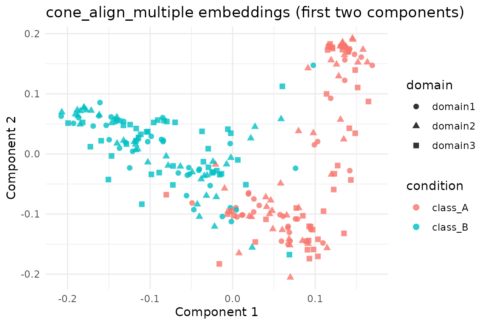

# Multi-Domain Graph Alignment with cone_align_multiple

## Overview

[`cone_align_multiple()`](https://bbuchsbaum.github.io/manifoldalign/reference/cone_align_multiple.md)
extends CONE-Align to three or more graph domains by iteratively
aligning each domain to a chosen reference graph. The algorithm
repeatedly solves pairwise Procrustes/assignment problems until node
correspondences stabilise.

This vignette demonstrates the workflow on the shared
`alignment_benchmark` dataset.

## Setup

``` r
library(manifoldalign)
library(multidesign)
library(multivarious)
library(tibble)
library(dplyr)
library(ggplot2)
```

## Loading the Benchmark Domains

``` r
alignment_benchmark <- manifoldalign::alignment_benchmark
multi_domains <- lapply(alignment_benchmark$domains, function(dom) {
  multidesign::multidesign(dom$x, dom$design)
})

multi_names <- names(multi_domains)
node_counts <- vapply(multi_domains, function(dom) nrow(dom$x), integer(1))

hd_multi <- multidesign::hyperdesign(multi_domains)
```

## Running `cone_align_multiple`

``` r
cone_multi <- cone_align_multiple(
  hd_multi,
  ref_idx = 1,
  ncomp = 6,
  sigma = 0.9,
  lambda = 0.05,
  solver = "linear",
  max_iter = 40,
  tol = 1e-3
)

str(cone_multi, max.level = 1)
#> List of 10
#>  $ v            : num [1:12, 1:6] 6.16 8.33 8.12 6.02 -5.89 ...
#>  $ s            : num [1:240, 1:6] 0.136 0.1405 0.0687 0.1189 0.1419 ...
#>  $ sdev         : num [1:6] 0.1068 0.1008 0.0893 0.0907 0.0883 ...
#>  $ preproc      : NULL
#>  $ block_indices:List of 3
#>  $ assignment   :List of 3
#>  $ rotation     :List of 3
#>  $ n_domains    : int 3
#>  $ ref_idx      : num 1
#>  $ iterations   : int 3
#>  - attr(*, "class")= chr [1:2] "cone_align_multiple" "multiblock_biprojector"
```

The reference domain (domain 1) is aligned to itself with the identity
permutation. For the remaining domains we evaluate how often aligned
pairs share the same latent class—again, labels were not used during
optimisation and serve purely as a diagnostic.

``` r
assignments <- cone_multi$assignment
ref_labels <- multi_domains[[1]]$design$condition

accuracy_values <- vapply(seq_along(multi_names)[-1], function(idx) {
  mean(ref_labels[assignments[[idx]]] == multi_domains[[idx]]$design$condition)
}, numeric(1))

accuracy_tbl <- tibble(
  domain = multi_names[-1],
  condition_accuracy = accuracy_values
)

accuracy_tbl
#> # A tibble: 2 × 2
#>   domain  condition_accuracy
#>   <chr>                <dbl>
#> 1 domain2              0.875
#> 2 domain3              0.85
```

## Visualising All Domains

``` r
# As with the pairwise vignette, class labels are only used for evaluation and
# plotting; `cone_align_multiple()` itself is unsupervised.

score_tbl <- as_tibble(as.matrix(cone_multi$s), .name_repair = "minimal")
colnames(score_tbl) <- paste0("comp", seq_len(ncol(score_tbl)))

scores <- score_tbl %>%
  mutate(
    domain = rep(multi_names, times = node_counts),
    condition = rep(ref_labels, length(multi_names))
  )

 ggplot(scores, aes(x = comp1, y = comp2, colour = condition, shape = domain)) +
  geom_point(size = 2, alpha = 0.8) +
  labs(title = "cone_align_multiple embeddings (first two components)",
       x = "Component 1", y = "Component 2") +
  theme_minimal()
```



## Summary

- [`cone_align_multiple()`](https://bbuchsbaum.github.io/manifoldalign/reference/cone_align_multiple.md)
  aligns every domain to a shared reference using a sequence of pairwise
  CONE-Align steps.
- On this benchmark the recovered correspondences preserve class labels
  across all domains (see the accuracy table above).
- Because the same dataset powers the `kema` and `gpca_align` vignettes,
  you can now benchmark graph-vs-kernel-vs-linear alignment on identical
  inputs while recognising that the CONE variants remain unsupervised.
