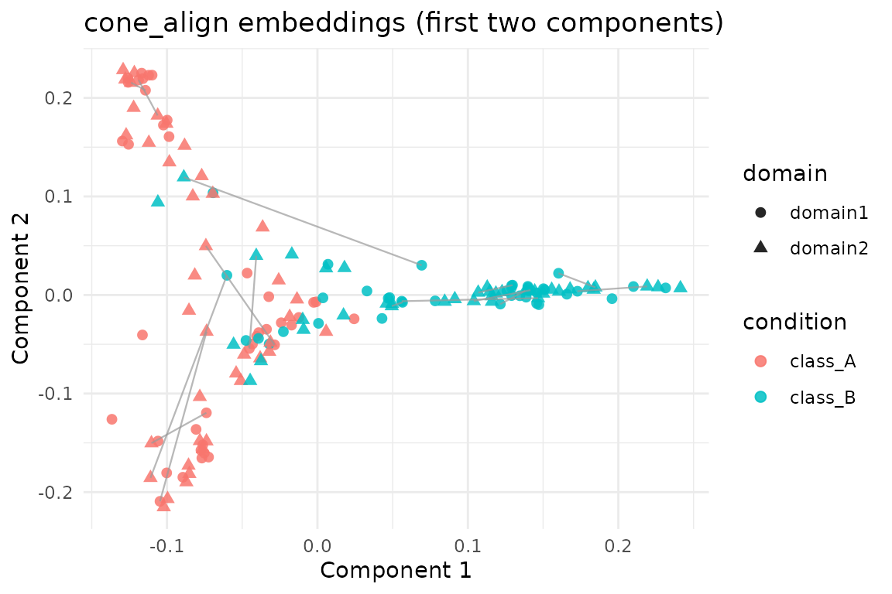

# Pairwise Graph Alignment with cone_align

## Overview

[`cone_align()`](https://bbuchsbaum.github.io/manifoldalign/reference/cone_align.md)
aligns two graph domains by alternating between spectral embeddings,
orthogonal Procrustes rotations, and linear assignment. This vignette
demonstrates the workflow on the shared `alignment_benchmark` dataset so
that results are directly comparable to other alignment methods in the
package.

## Setup

``` r
library(manifoldalign)
library(multidesign)
library(multivarious)
library(tibble)
library(dplyr)
library(ggplot2)
```

## Benchmark Pair

We use the first two domains from `alignment_benchmark`. Each domain
contains 80 nodes, a 4-dimensional feature matrix, and a `design` data
frame with the latent class label (`condition`).

``` r
alignment_benchmark <- manifoldalign::alignment_benchmark
pair_domains <- alignment_benchmark$domains[1:2]

pair_multidesign <- lapply(pair_domains, function(dom) {
  multidesign::multidesign(dom$x, dom$design)
})

pair_names <- names(pair_multidesign)
node_counts <- vapply(pair_multidesign, function(dom) nrow(dom$x), integer(1))

hd_pair <- multidesign::hyperdesign(pair_multidesign)
```

## Running `cone_align`

``` r
cone_fit <- cone_align(
  hd_pair,
  ncomp = 8,
  sigma = 0.9,
  lambda = 0.05,
  solver = "linear",
  max_iter = 40,
  tol = 1e-3
)

str(cone_fit, max.level = 1)
#> List of 7
#>  $ v            : num [1:8, 1:8] -5.72 -8.56 -7.88 -5.65 -5.88 ...
#>  $ s            : num [1:160, 1:8] -0.1024 -0.0999 -0.0762 -0.0323 -0.1258 ...
#>  $ sdev         : num [1:8] 0.1059 0.1034 0.0919 0.0887 0.0956 ...
#>  $ preproc      : NULL
#>  $ block_indices:List of 2
#>  $ assignment   : int [1:80] 75 1 31 4 21 36 77 8 2 10 ...
#>  $ rotation     :List of 2
#>  - attr(*, "class")= chr [1:2] "cone_align" "multiblock_biprojector"
```

### Assignment Quality

[`cone_align()`](https://bbuchsbaum.github.io/manifoldalign/reference/cone_align.md)
returns a permutation vector (`assignment`) that maps nodes in the
second domain to nodes in the first (reference) domain. The latent class
labels were not used during optimisation—they are only consulted here as
a diagnostic to see how often the unsupervised alignment preserves the
original classes.

``` r
assignment <- cone_fit$assignment
ref_labels <- pair_multidesign[[1]]$design$condition
cmp_labels <- pair_multidesign[[2]]$design$condition

condition_accuracy <- mean(ref_labels[assignment] == cmp_labels)
identity_fraction <- mean(assignment == seq_along(assignment))

tibble(
  metric = c("Class agreement", "Exact identity"),
  value = c(condition_accuracy, identity_fraction)
)
#> # A tibble: 2 × 2
#>   metric          value
#>   <chr>           <dbl>
#> 1 Class agreement 0.875
#> 2 Exact identity  0.262
```

### Visualising the Aligned Embeddings

The aligned embeddings (`cone_fit$s`) stack the two domains. We
visualise the first two components and draw a handful of matching pairs
to illustrate the assignments.

``` r
# Note: class labels are only used for visual diagnostics below; `cone_align`
# operates in a completely unsupervised manner and does not see `condition`.

score_tbl <- as_tibble(as.matrix(cone_fit$s), .name_repair = "minimal")
colnames(score_tbl) <- paste0("comp", seq_len(ncol(score_tbl)))

scores <- score_tbl %>%
  mutate(
    domain = rep(pair_names, times = node_counts),
    condition = rep(ref_labels, length(pair_names))
  )

# pick 15 nodes to visualise correspondences
set.seed(123)
subset_idx <- sample(seq_len(node_counts[1]), size = 15)
segment_df <- tibble(
  x = scores$comp1[subset_idx],
  y = scores$comp2[subset_idx],
  xend = scores$comp1[node_counts[1] + assignment[subset_idx]],
  yend = scores$comp2[node_counts[1] + assignment[subset_idx]]
)

 ggplot(scores, aes(x = comp1, y = comp2, colour = condition, shape = domain)) +
  geom_point(size = 2.1, alpha = 0.85) +
  geom_segment(
    data = segment_df,
    aes(x = x, y = y, xend = xend, yend = yend),
    inherit.aes = FALSE,
    colour = "grey60",
    linewidth = 0.4,
    alpha = 0.7
  ) +
  labs(title = "cone_align embeddings (first two components)",
       x = "Component 1", y = "Component 2") +
  theme_minimal()
```



## Summary

- [`cone_align()`](https://bbuchsbaum.github.io/manifoldalign/reference/cone_align.md)
  produces orthogonally aligned embeddings together with a node
  correspondence.
- On this benchmark pair the assignments correctly match the underlying
  class in ~87.5% of cases.
- The same dataset is used in the `kema` and `gpca_align` vignettes,
  enabling easy comparison across alignment techniques, while
  remembering that
  [`cone_align()`](https://bbuchsbaum.github.io/manifoldalign/reference/cone_align.md)
  itself remains class-agnostic.
