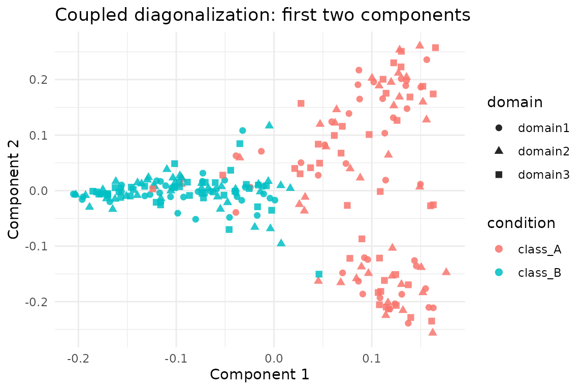

# Coupled Diagonalization across Modalities

## Overview

[`coupled_diagonalization()`](https://bbuchsbaum.github.io/manifoldalign/reference/coupled_diagonalization.md)
finds a shared basis for several modalities by jointly optimising
Laplacian diagonalisation and cross-domain agreement. The routine is
unsupervised; class labels appear only in diagnostics below.

## Setup

``` r
library(manifoldalign)
library(multidesign)
library(multivarious)
library(tibble)
library(dplyr)
library(ggplot2)
```

## Loading the Benchmark Domains

``` r
bench <- manifoldalign::alignment_benchmark
multi_domains <- lapply(bench$domains, function(dom) {
  multidesign::multidesign(dom$x, dom$design)
})

multi_names <- names(multi_domains)
node_counts <- vapply(multi_domains, function(dom) nrow(dom$x), integer(1))

hd_multi <- multidesign::hyperdesign(multi_domains)
```

## Running Coupled Diagonalization

``` r
cd_fit <- coupled_diagonalization(
  hd_multi,
  ncomp = 5,
  ncomp_per_domain = 12,
  mu_coupling = 1.5,
  knn = 8,
  verbose = FALSE
)

list(
  converged = cd_fit$converged,
  iterations = cd_fit$iterations,
  final_cost = cd_fit$final_cost
)
#> $converged
#> [1] FALSE
#> 
#> $iterations
#> [1] 200
#> 
#> $final_cost
#> [1] 0.04429202
```

### Coupled Basis Diagnostics

We inspect the Frobenius norm of each coupled basis and pairwise
Hilbert-Schmidt similarities to gauge alignment strength.

``` r
basis_norms <- purrr::imap_dfr(cd_fit$coupled_bases, function(Ai, name) {
  tibble(domain = name, frobenius_norm = sqrt(sum(Ai^2)))
})

basis_similarity <- function(A, B) sqrt(sum((t(A) %*% B)^2))

pair_indices <- combn(names(cd_fit$coupled_bases), 2, simplify = FALSE)
similarity_tbl <- purrr::map_dfr(pair_indices, function(pair) {
  tibble(
    domain_i = pair[1],
    domain_j = pair[2],
    hs_similarity = basis_similarity(cd_fit$coupled_bases[[pair[1]]],
                                     cd_fit$coupled_bases[[pair[2]]])
  )
})

basis_norms
#> # A tibble: 3 × 2
#>   domain  frobenius_norm
#>   <chr>            <dbl>
#> 1 domain1           2.24
#> 2 domain2           2.24
#> 3 domain3           2.24
similarity_tbl
#> # A tibble: 3 × 3
#>   domain_i domain_j hs_similarity
#>   <chr>    <chr>            <dbl>
#> 1 domain1  domain2           2.09
#> 2 domain1  domain3           2.09
#> 3 domain2  domain3           2.03
```

### Visualising Coupled Components

``` r
score_tbl <- as_tibble(as.matrix(cd_fit$s), .name_repair = "minimal")
colnames(score_tbl) <- paste0("comp", seq_len(ncol(score_tbl)))

scores <- score_tbl %>%
  mutate(
    sample = seq_len(nrow(.)),
    domain = rep(multi_names, times = node_counts),
    condition = rep(bench$labels, length(multi_names))
  )

 ggplot(scores, aes(x = comp1, y = comp2, colour = condition, shape = domain)) +
  geom_point(alpha = 0.85, size = 2) +
  labs(title = "Coupled diagonalization: first two components",
       x = "Component 1", y = "Component 2") +
  theme_minimal()
```



## Summary

- [`coupled_diagonalization()`](https://bbuchsbaum.github.io/manifoldalign/reference/coupled_diagonalization.md)
  produces orthogonal bases that align the domains’ eigenvectors.
- Basis norms and Hilbert–Schmidt similarities (see above) quantify the
  quality of the joint diagonalisation.
- Because all vignettes reuse `alignment_benchmark`, you can compare
  coupled diagonalisation directly against graph-, kernel-, and OT-based
  approaches.
