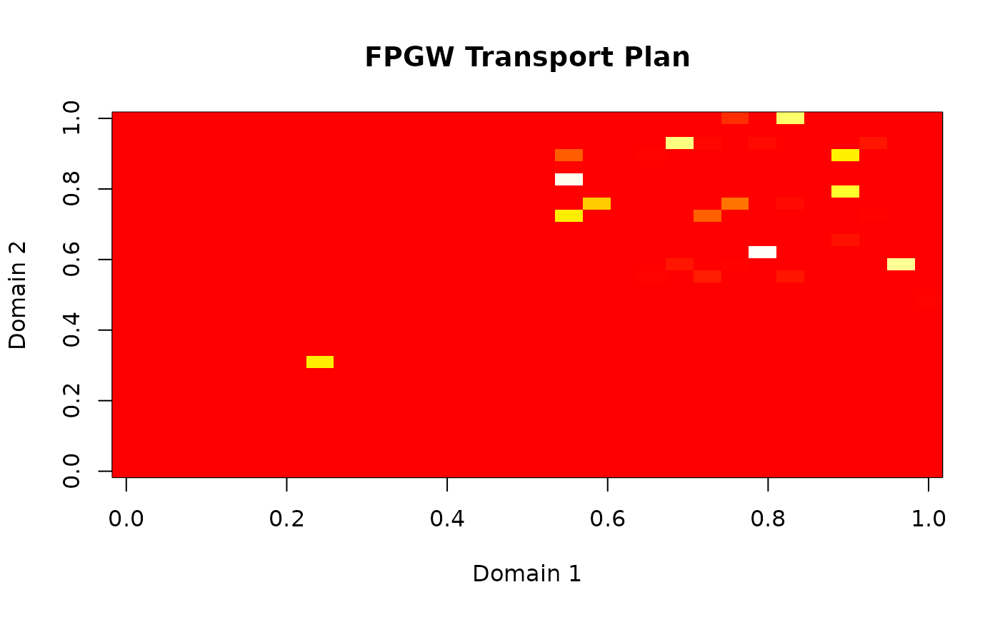

# Fused-Partial Gromov-Wasserstein for Domain Alignment

``` r
library(manifoldalign)
library(multidesign)
library(tibble)
```

## Introduction

The Fused-Partial Gromov-Wasserstein (FPGW) distance is a powerful tool
for aligning domains with:

- Different feature spaces (heterogeneous domains)
- Partial correspondence (not all samples need to match)
- Combined attribute and structural information

This vignette demonstrates how to use FPGW for various domain alignment
tasks.

## Basic Usage

### Classical Fused Gromov-Wasserstein

The simplest case aligns two domains using both feature and structural
information:

``` r
# Create synthetic data with different dimensions
set.seed(123)
n1 <- 30
n2 <- 30

# Domain 1: 3D data
X1 <- matrix(rnorm(n1 * 3), n1, 3)
X1[1:15, ] <- X1[1:15, ] + 2  # Create two clusters

# Domain 2: 5D data with similar structure
X2 <- matrix(rnorm(n2 * 5), n2, 5)
X2[1:15, ] <- X2[1:15, ] + 2

# Create hyperdesign object
design1 <- data.frame(id = 1:n1, cluster = rep(1:2, each = 15))
design2 <- data.frame(id = 1:n2, cluster = rep(1:2, each = 15))

md1 <- multidesign(X1, design1)
md2 <- multidesign(X2, design2)
hd <- hyperdesign(list(domain1 = md1, domain2 = md2))

# Compute FPGW alignment
result <- fpgw(hd, omega1 = 0.5, verbose = TRUE)
#> FPGW: Computing distance between domain 1 and 2
#>   Iteration  10: FW gap = 9.746e-01, alpha = 0.000
#>   Iteration  20: FW gap = 9.746e-01, alpha = 0.000
#>   Iteration  30: FW gap = 9.746e-01, alpha = 0.000
#>   Iteration  40: FW gap = 9.746e-01, alpha = 0.000
#>   Iteration  50: FW gap = 9.746e-01, alpha = 0.000
#>   Iteration  60: FW gap = 9.746e-01, alpha = 0.000
#>   Iteration  70: FW gap = 9.746e-01, alpha = 0.000
#>   Iteration  80: FW gap = 9.746e-01, alpha = 0.000
#>   Iteration  90: FW gap = 9.746e-01, alpha = 0.000
#>   Iteration 100: FW gap = 9.746e-01, alpha = 0.000
#>   Iteration 110: FW gap = 9.746e-01, alpha = 0.000
#>   Iteration 120: FW gap = 9.746e-01, alpha = 0.000
#>   Iteration 130: FW gap = 9.746e-01, alpha = 0.000
#>   Iteration 140: FW gap = 9.746e-01, alpha = 0.000
#>   Iteration 150: FW gap = 9.746e-01, alpha = 0.000
#>   Iteration 160: FW gap = 9.746e-01, alpha = 0.000
#>   Iteration 170: FW gap = 9.746e-01, alpha = 0.000
#>   Iteration 180: FW gap = 9.746e-01, alpha = 0.000
#>   Iteration 190: FW gap = 9.746e-01, alpha = 0.000
#>   Iteration 200: FW gap = 9.746e-01, alpha = 0.000
print(result)
#> Fused-Partial Gromov-Wasserstein
#> ================================
#> Number of domains: 2 
#> Domain names: domain1, domain2 
#> Feature weight (omega1): 0.5 
#> Mode: Classical Fused GW
#> 
#> Pairwise distances:
#>        [,1]   [,2]
#> [1,] 0.0000 0.4898
#> [2,] 0.4898 0.0000
#> 
#> Warning: Some optimizations did not converge
#> Non-converged pairs:
#>   (domain1, domain2)
```

### Interpreting the Transport Plan

The transport plan shows how samples from one domain map to another:

``` r
# Extract transport plan
P <- result$transport_plans[[1]]

# Find strongest connections
threshold <- 0.05
strong_connections <- which(P > threshold, arr.ind = TRUE)
head(strong_connections)
#>      row col

# Visualize transport plan
image(P, main = "FPGW Transport Plan", 
      xlab = "Domain 1", ylab = "Domain 2",
      col = heat.colors(100))
```



## Partial Transport Variants

### Mass-Constrained FPGW

When domains have outliers or noise, you may want to transport only a
fraction of the mass:

``` r
# Add outliers to domain 2
X2_noisy <- rbind(X2, matrix(rnorm(10 * 5, sd = 5), 10, 5))
design2_noisy <- data.frame(id = 1:(n2 + 10), 
                           cluster = c(rep(1:2, each = 15), rep(3, 10)))

md2_noisy <- multidesign(X2_noisy, design2_noisy)
hd_noisy <- hyperdesign(list(domain1 = md1, domain2 = md2_noisy))

# Transport only 80% of mass to avoid outliers
result_partial <- fpgw(hd_noisy, omega1 = 0.5, rho = 0.8)

# Check transported mass
P_partial <- result_partial$transport_plans[[1]]
cat("Total transported mass:", sum(P_partial), "\n")
#> Total transported mass: 0.2564186
```

### TV-Penalized FPGW

The total variation penalty provides a soft constraint on transported
mass:

``` r
# Use TV penalty instead of hard mass constraint
result_tv <- fpgw(hd_noisy, omega1 = 0.5, lambda = 0.1)

P_tv <- result_tv$transport_plans[[1]]
cat("Total transported mass with TV penalty:", sum(P_tv), "\n")
#> Total transported mass with TV penalty: 0.2564186
```

## Controlling Feature vs Structure Weight

The `omega1` parameter controls the balance between feature and
structural alignment:

``` r
# Pure structural alignment (small omega1)
result_struct <- fpgw(hd, omega1 = 0.01)

# Balanced alignment
result_balanced <- fpgw(hd, omega1 = 0.5)

# Pure feature alignment (large omega1)
result_feature <- fpgw(hd, omega1 = 0.99)

# Compare distances
cat("Structural emphasis distance:", result_struct$distances[1,2], "\n")
#> Structural emphasis distance: 0.2036896
cat("Balanced distance:", result_balanced$distances[1,2], "\n")
#> Balanced distance: 0.4897807
cat("Feature emphasis distance:", result_feature$distances[1,2], "\n")
#> Feature emphasis distance: 0.001246166
```

## Multi-Domain Alignment

FPGW can align multiple domains simultaneously:

``` r
# Create three domains with varying dimensions
X3 <- matrix(rnorm(25 * 4), 25, 4)
X3[1:12, ] <- X3[1:12, ] + 2

design3 <- data.frame(id = 1:25, cluster = c(rep(1, 12), rep(2, 13)))
md3 <- multidesign(X3, design3)

# Create hyperdesign with three domains
hd_multi <- hyperdesign(list(
  domain1 = md1,
  domain2 = md2,
  domain3 = md3
))

# Compute pairwise alignments
result_multi <- fpgw(hd_multi, omega1 = 0.3)

# Distance matrix between all domains
print(result_multi$distances)
#>           [,1]      [,2]      [,3]
#> [1,] 0.0000000 0.6346543 0.6482231
#> [2,] 0.6346543 0.0000000 0.6902467
#> [3,] 0.6482231 0.6902467 0.0000000
```

## Performance Considerations

The FPGW implementation uses optimized C++ code for performance:

``` r
# Compare performance for different problem sizes
sizes <- c(20, 50, 100)
times <- numeric(length(sizes))

for (i in seq_along(sizes)) {
  n <- sizes[i]
  X1_test <- matrix(rnorm(n * 5), n, 5)
  X2_test <- matrix(rnorm(n * 5), n, 5)
  
  design_test <- data.frame(id = 1:n)
  hd_test <- hyperdesign(list(
    d1 = multidesign(X1_test, design_test),
    d2 = multidesign(X2_test, design_test)
  ))
  
  times[i] <- system.time({
    fpgw(hd_test, omega1 = 0.5, max_iter = 10, verbose = FALSE)
  })[3]
}

plot(sizes, times, type = "b", 
     xlab = "Problem size (n)", ylab = "Time (seconds)",
     main = "FPGW Scaling Performance")
```


## Advanced Usage

### Custom Distance Metrics

You can use different distance metrics for within-domain distances:

``` r
# Use Manhattan distance instead of Euclidean
result_manhattan <- fpgw(hd, omega1 = 0.5, metric = "manhattan")
```

## References

- Bai et al. (2025). Fused-Partial Gromov-Wasserstein Distance for
  Heterogeneous Domain Adaptation. arXiv preprint.
- Peyré & Cuturi (2019). Computational Optimal Transport. Foundations
  and Trends in Machine Learning.
