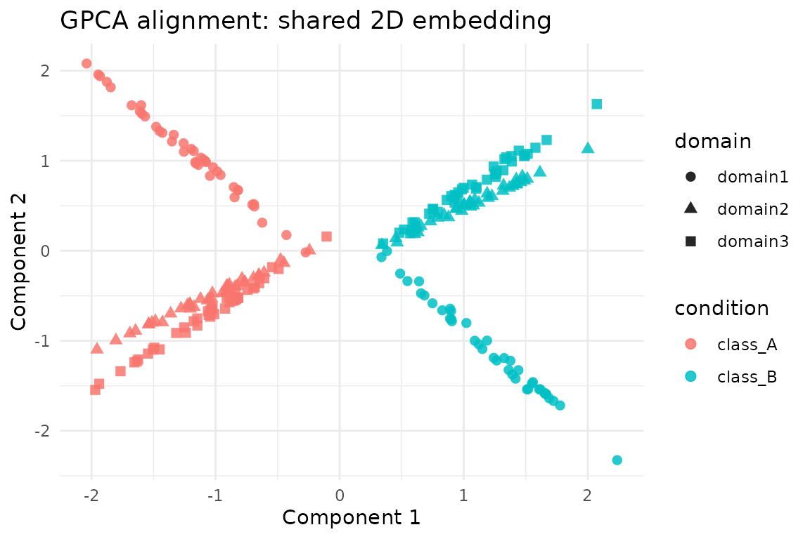

# Generalized PCA Alignment with gpca_align

## Overview

[`gpca_align()`](https://bbuchsbaum.github.io/manifoldalign/reference/gpca_align.md)
implements Generalized PCA alignment. It constructs a coupled metric
across domains and then solves a generalized PCA problem to obtain a
shared latent embedding. The helper
[`gpca_align_control()`](https://bbuchsbaum.github.io/manifoldalign/reference/gpca_align_control.md)
exposes safeguards for graph sparsification, label balancing and
dense-matrix memory limits, making it practical on real data.

This vignette walks through a minimal pipeline:

1.  Load a reusable **hyperdesign** dataset with three related domains.
2.  Run
    [`gpca_align()`](https://bbuchsbaum.github.io/manifoldalign/reference/gpca_align.md)
    and inspect the aligned scores.
3.  Tune graph sparsity and balancing with
    [`gpca_align_control()`](https://bbuchsbaum.github.io/manifoldalign/reference/gpca_align_control.md).

The code below only relies on public package APIs, so you can copy–paste
it when exploring your own data.

## Setup

``` r
library(manifoldalign)
library(multidesign)
library(multivarious)
library(tibble)
library(dplyr)
library(ggplot2)
library(purrr)
```

## Constructing a Hyperdesign

We reuse the packaged benchmark dataset so every alignment vignette
operates on identical inputs. It contains three domains with two latent
classes and moderate domain-specific transformations.

``` r
alignment_benchmark <- manifoldalign::alignment_benchmark
domain_list <- lapply(alignment_benchmark$domains, function(dom) {
  multidesign(dom$x, dom$design)
})
hd <- hyperdesign(domain_list)
labels <- alignment_benchmark$labels
domain_names <- names(domain_list)
domain_sizes <- vapply(domain_list, function(dom) nrow(dom$x), integer(1))
```

When `data` is a `hyperdesign`, call
[`gpca_align()`](https://bbuchsbaum.github.io/manifoldalign/reference/gpca_align.md)
and supply the label column name via the `y` argument.

``` r
base_preproc <- replicate(length(domain_names), multivarious::pass(), simplify = FALSE)

gpca_fit <- gpca_align(
  hd,
  y = condition,
  ncomp = 2,
  u = 0.6,           # balance within/between alignment
  lambda = 1e-2,     # light ridge regularisation
  preproc = base_preproc
)

str(gpca_fit, max.level = 1)
#> List of 6
#>  $ v            : num [1:12, 1:2] -0.342 -0.361 -0.294 -0.246 -0.306 ...
#>   ..- attr(*, "dimnames")=List of 2
#>  $ preproc      :List of 2
#>   ..- attr(*, "class")= chr [1:2] "concat_pre_processor" "pre_processor"
#>  $ s            : num [1:240, 1:2] -0.112 -0.153 -0.161 -0.201 -0.148 ...
#>   ..- attr(*, "dimnames")=List of 2
#>  $ sdev         : num [1:2] 5.94 5.22
#>  $ block_indices:List of 3
#>  $ labels       : Factor w/ 2 levels "class_A","class_B": 1 1 1 1 1 1 1 1 1 1 ...
#>  - attr(*, "class")= chr [1:5] "gpca_align" "multiblock_biprojector" "multiblock_projector" "bi_projector" ...
#>  - attr(*, ".cache")=<environment: 0x560736f19bc0>
```

``` r
rms_alignment(as.matrix(gpca_fit$s), domain_sizes, domain_names)
#> # A tibble: 3 × 3
#>   domain_i domain_j    rms
#>   <chr>    <chr>     <dbl>
#> 1 domain1  domain2  0.205 
#> 2 domain1  domain3  0.231 
#> 3 domain2  domain3  0.0333
```

The result is a `multiblock_biprojector`, so we can extract scores and
feature loadings just like other `multivarious` models. For plotting
below we z-score the aligned scores so that the scale matches other
vignettes.

You can optionally pass a domain-specific preprocessing list (e.g.
`list(center(), center(), center())`) if you want to centre or scale
each block before alignment. Passing the `base_preproc` list (built
above with
[`multivarious::pass()`](https://bbuchsbaum.github.io/multivarious/reference/pass.html))
keeps preprocessing as the identity—which keeps this example lightweight
while still supporting different feature dimensions.

``` r
score_tbl <- as_tibble(zscore_columns(as.matrix(gpca_fit$s)), .name_repair = "minimal")
colnames(score_tbl) <- paste0("comp", seq_len(ncol(score_tbl)))

scores <- score_tbl %>%
  mutate(
    sample = seq_len(nrow(.)),
    domain = rep(domain_names, times = domain_sizes),
    condition = rep(labels, length(domain_names))
  )

head(scores)
#> # A tibble: 6 × 5
#>    comp1 comp2 sample domain  condition
#>    <dbl> <dbl>  <int> <chr>   <fct>    
#> 1 -0.819 0.674      1 domain1 class_A  
#> 2 -1.48  1.38       2 domain1 class_A  
#> 3 -1.18  1.11       3 domain1 class_A  
#> 4 -1.95  1.96       4 domain1 class_A  
#> 5 -1.08  0.997      5 domain1 class_A  
#> 6 -1.45  1.33       6 domain1 class_A
```

### Visualising the Shared Embedding

``` r
 ggplot(scores, aes(x = comp1, y = comp2, colour = condition, shape = domain)) +
  geom_point(size = 2.2, alpha = 0.85) +
  labs(
    title = "GPCA alignment: shared 2D embedding",
    x = "Component 1",
    y = "Component 2"
  ) +
  theme_minimal()
```



## Controlling Graph Sparsification and Balancing

The optional `control` argument feeds through to
[`gpca_align_control()`](https://bbuchsbaum.github.io/manifoldalign/reference/gpca_align_control.md),
letting you adjust k-NN sparsification, label balancing and memory caps.
Here we build a denser within-domain graph but down-weight the majority
class via label balancing.

``` r
ctrl <- gpca_align_control(
  knn = 10,
  knn_mode = "mutual",
  balance = "within",
  balance_power = 0.5,
  normalize = "edges",
  verbose = FALSE
)

gpca_dense <- gpca_align(
  hd,
  y = condition,
  ncomp = 2,
  control = ctrl,
  preproc = base_preproc
)

summary(gpca_dense$sdev)
#>    Min. 1st Qu.  Median    Mean 3rd Qu.    Max. 
#>   5.633   5.703   5.773   5.773   5.843   5.912
```

When working with larger domains, consider leaving `knn = NA` (the
default) to use fully dense metrics or lower the `max_dense_elems`
parameter to enforce a safe memory ceiling. If
[`gpca_align()`](https://bbuchsbaum.github.io/manifoldalign/reference/gpca_align.md)
detects that densifying the block matrix would exceed the limit, it
aborts with a diagnostic message so you can tighten the sparsification
or dimensionality reduction beforehand.

## Next Steps

- [`gpca_align()`](https://bbuchsbaum.github.io/manifoldalign/reference/gpca_align.md)
  returns a standard `multivarious` projector, so you can call
  [`predict()`](https://rdrr.io/r/stats/predict.html) on new samples
  (via
  [`multivarious::multiblock_biprojector`](https://bbuchsbaum.github.io/multivarious/reference/multiblock_biprojector.html)).
- The RMS alignment summary above shows how closely each domain pair
  agrees in the coupled space; values near zero indicate strong
  agreement.
- Use
  [`gpca_align_control()`](https://bbuchsbaum.github.io/manifoldalign/reference/gpca_align_control.md)
  to add sparsification or label balancing when operating at larger
  scale.
- Pair
  [`gpca_align()`](https://bbuchsbaum.github.io/manifoldalign/reference/gpca_align.md)
  with
  [`kema()`](https://bbuchsbaum.github.io/manifoldalign/reference/kema.md)
  or
  [`grasp()`](https://bbuchsbaum.github.io/manifoldalign/reference/grasp.md)
  in the same pipeline to compare linear vs kernel alignment strategies.

This vignette is intentionally lightweight—swap in your own domains or
expand chunks to benchmark larger settings.
