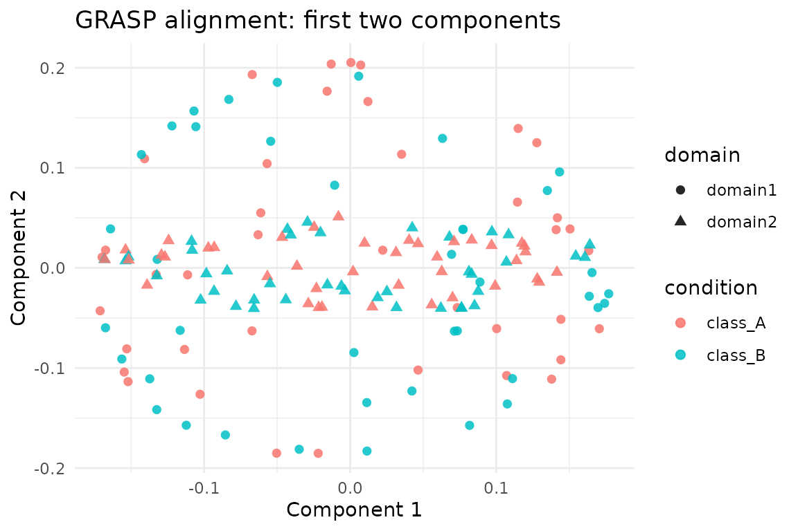

# Spectral Graph Alignment with grasp

## Overview

[`grasp()`](https://bbuchsbaum.github.io/manifoldalign/reference/grasp.md)
aligns two graph domains by computing spectral embeddings, building
multi-scale diffusion descriptors, and solving for a functional map plus
a node assignment. The method is unsupervised—the latent classes are
only consulted in this vignette for diagnostic plots.

We work with the two graph domains provided by `alignment_benchmark` so
the results are directly comparable to the `cone_align`, `parrot`, and
`kema` vignettes.

## Setup

``` r
library(manifoldalign)
library(multidesign)
library(multivarious)
library(tibble)
library(dplyr)
library(ggplot2)
library(scales)
```

## Loading the Benchmark Pair

``` r
alignment_benchmark <- manifoldalign::alignment_benchmark
pair_domains <- alignment_benchmark$domains[1:2]

pair_multidesign <- lapply(pair_domains, function(dom) {
  multidesign::multidesign(dom$x, dom$design)
})

pair_names <- names(pair_multidesign)
node_counts <- vapply(pair_multidesign, function(dom) nrow(dom$x), integer(1))

hd_pair <- multidesign::hyperdesign(pair_multidesign)
```

## Running `grasp`

``` r
grasp_internal <- grasp(
  hd_pair,
  ncomp = 20,
  q_descriptors = 80,
  sigma = 0.8,
  lambda = 0.1,
  solver = "linear"
)

str(grasp_internal$assignment)
#>  int [1:80] 79 66 29 53 37 13 7 61 17 65 ...
```

### Assignment Diagnostics

The `assignment` component maps nodes in the second domain to nodes in
the first (reference) domain. We compare the assigned pairs with the
underlying class labels to quantify alignment quality—remember that the
optimiser itself never sees these labels.

``` r
assignment <- grasp_internal$assignment
ref_design <- pair_multidesign[[1]]$design
cmp_design <- pair_multidesign[[2]]$design

class_accuracy <- mean(ref_design$condition == cmp_design$condition[assignment])
identity_fraction <- mean(assignment == seq_along(assignment))

tibble(
  metric = c("Class agreement", "Exact identity"),
  value = c(class_accuracy, identity_fraction)
)
#> # A tibble: 2 × 2
#>   metric           value
#>   <chr>            <dbl>
#> 1 Class agreement 0.475 
#> 2 Exact identity  0.0125
```

``` r
n_ref <- node_counts[1]
embed1 <- grasp_internal$s[seq_len(n_ref), , drop = FALSE]
embed2 <- grasp_internal$s[n_ref + seq_len(n_ref), , drop = FALSE]
final_err <- sqrt(mean(rowSums((embed1 - embed2)^2)))

tibble(
  metric = "Post-alignment RMS error",
  value = final_err
)
#> # A tibble: 1 × 2
#>   metric                   value
#>   <chr>                    <dbl>
#> 1 Post-alignment RMS error  1.28
```

### Visualising the Aligned Embeddings

We stack the aligned embeddings for both domains (as returned by
[`grasp()`](https://bbuchsbaum.github.io/manifoldalign/reference/grasp.md))
and colour points by their latent class.

``` r
embed1 <- grasp_internal$s[seq_len(n_ref), , drop = FALSE]
embed2 <- grasp_internal$s[n_ref + seq_len(n_ref), , drop = FALSE]

score_tbl <- as_tibble(rbind(embed1, embed2), .name_repair = "minimal")
colnames(score_tbl) <- paste0("comp", seq_len(ncol(score_tbl)))

scores <- score_tbl %>%
  mutate(
    sample = seq_len(nrow(.)),
    domain = rep(pair_names, each = nrow(embed1)),
    condition = c(ref_design$condition, cmp_design$condition[assignment])
  )

 ggplot(scores, aes(x = comp1, y = comp2, colour = condition, shape = domain)) +
  geom_point(size = 2, alpha = 0.85) +
  labs(title = "GRASP alignment: first two components",
       x = "Component 1", y = "Component 2") +
  theme_minimal()
```



## Summary

- [`grasp()`](https://bbuchsbaum.github.io/manifoldalign/reference/grasp.md)
  performs spectral alignment without supervision; class labels are only
  used here for evaluation.
- The post-alignment RMS error can be used as a quick sanity check that
  the returned embeddings are in a comparable coordinate system.
- Because all alignment vignettes reuse the same `alignment_benchmark`
  domains, you can compare GRASP, CONE-Align, PARROT, GPCA, and KEMA
  directly.
