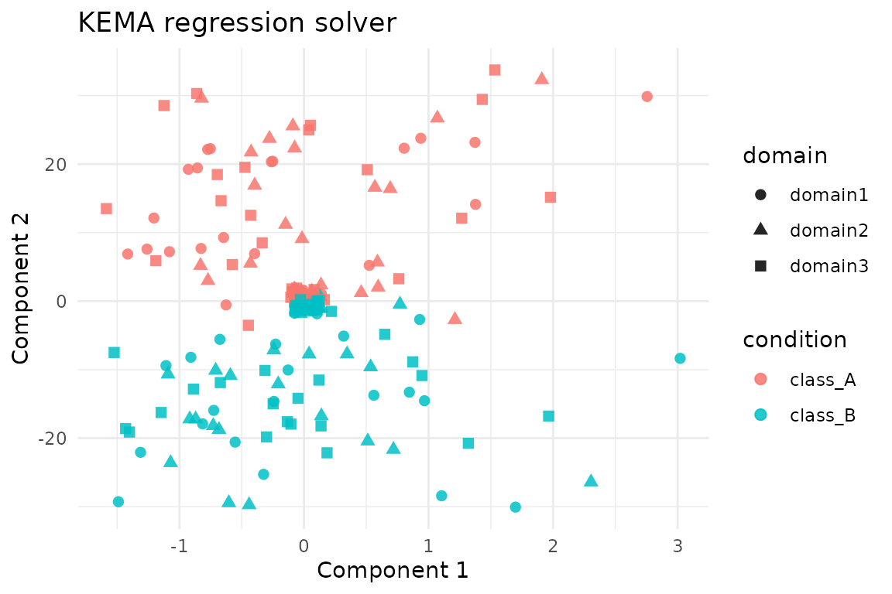
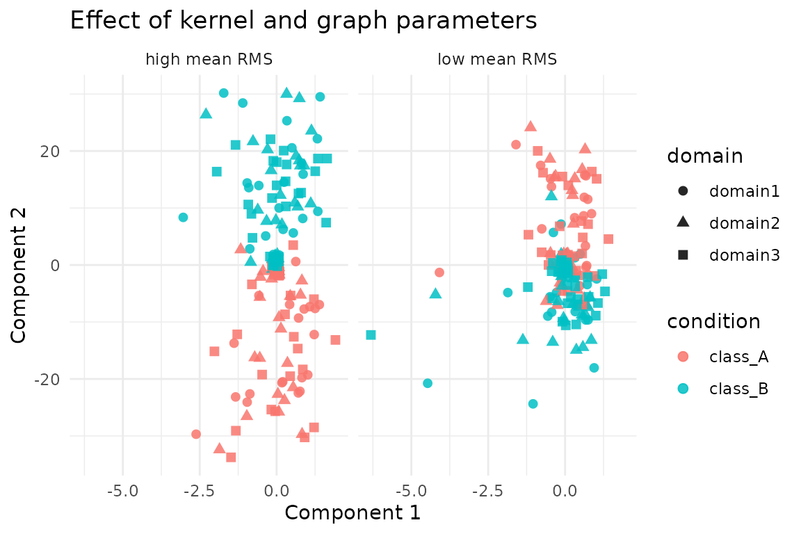

# Kernel Manifold Alignment with kema

## Overview

[`kema()`](https://bbuchsbaum.github.io/manifoldalign/reference/kema.md)
aligns multiple domains by projecting them into a shared latent space
where both manifold geometry and class structure are preserved. The
function supports:

- **Full KEMA** (exact or regression solver) on the complete kernel
  matrices
- **REKEMA** landmark approximations via `sample_frac`
- A scalable path (enabled with `options(kema.scalable_mode = TRUE)`)
  that replaces dense label graphs and block-diagonal kernels by compact
  operators

This vignette demonstrates each mode on the shared `alignment_benchmark`
dataset so that comparisons across alignment methods are directly
comparable.

## Setup

``` r
library(manifoldalign)
library(multidesign)
library(multivarious)
library(tibble)
library(dplyr)
library(tidyr)
library(ggplot2)
library(purrr)
```

## Benchmark Hyperdesign

We load `alignment_benchmark`, which provides three domains with two
latent classes and modest domain-specific transformations.

``` r
alignment_benchmark <- manifoldalign::alignment_benchmark
domain_list <- lapply(alignment_benchmark$domains, function(dom) {
  multidesign(dom$x, dom$design)
})
hd <- hyperdesign(domain_list)
labels <- alignment_benchmark$labels
domain_names <- names(domain_list)
domain_sizes <- vapply(domain_list, function(dom) nrow(dom$x), integer(1))
replicated_labels <- rep(labels, length(domain_names))
```

## Full KEMA (Regression Solver)

The regression solver is the default. It solves an eigenproblem on graph
Laplacians and follows with a ridge-regression step to recover kernel
coefficients. Because the domains have different feature dimensions we
use
[`multivarious::pass()`](https://bbuchsbaum.github.io/multivarious/reference/pass.html)
(no preprocessing) to avoid broadcasting a shared preprocessor across
incompatible shapes.

``` r
reg_fit <- kema(
  hd,
  y = condition,
  ncomp = 2,
  knn = 3,
  sigma = 0.8,
  solver = "regression",
  preproc = multivarious::pass()
)

str(reg_fit, max.level = 1)
#> List of 13
#>  $ v            : num [1:12, 1:2] -0.1363 -0.3086 -0.4057 0.6629 -0.0448 ...
#>  $ preproc      :List of 2
#>   ..- attr(*, "class")= chr [1:2] "concat_pre_processor" "pre_processor"
#>  $ s            :Formal class 'dgeMatrix' [package "Matrix"] with 4 slots
#>  $ sdev         : num [1:2] 0.0126 0.2044
#>  $ block_indices:List of 3
#>  $ alpha        : num [1:240, 1:2] 0.03815 0.15544 -0.08751 0.21601 -0.00162 ...
#>  $ Ks           :List of 3
#>  $ sample_frac  : num 1
#>  $ dweight      : num 0.1
#>  $ rweight      : num 0
#>  $ labels       : Factor w/ 2 levels "class_A","class_B": 1 1 1 1 1 1 1 1 1 1 ...
#>   ..- attr(*, "names")= chr [1:240] "domain11" "domain12" "domain13" "domain14" ...
#>  $ eigenvalues  :List of 3
#>  $ retry_info   :List of 3
#>  - attr(*, "class")= chr [1:5] "kema" "multiblock_biprojector" "multiblock_projector" "bi_projector" ...
#>  - attr(*, ".cache")=<environment: 0x559fd8ec0458>
```

``` r
rms_alignment(as.matrix(reg_fit$s), domain_sizes, domain_names)
#> # A tibble: 3 × 3
#>   domain_i domain_j   rms
#>   <chr>    <chr>    <dbl>
#> 1 domain1  domain2  0.132
#> 2 domain1  domain3  0.123
#> 3 domain2  domain3  0.147
```

We plot z-scored aligned scores (each component standardized across all
domains); this keeps the visual scale comparable while preserving class
separation.

``` r
score_tbl <- as_tibble(zscore_columns(as.matrix(reg_fit$s)), .name_repair = "minimal")
colnames(score_tbl) <- paste0("comp", seq_len(ncol(score_tbl)))

reg_scores <- score_tbl %>%
  mutate(
    domain = rep(domain_names, times = domain_sizes),
    condition = replicated_labels
  )

ggplot(reg_scores, aes(x = comp1, y = comp2, colour = condition, shape = domain)) +
  geom_point(size = 2.2, alpha = 0.85) +
  labs(title = "KEMA regression solver", x = "Component 1", y = "Component 2") +
  theme_minimal()
```



## Full KEMA (Exact Solver)

The exact solver tackles the generalized eigenvalue problem directly. It
is more faithful but slower on very large kernels.

``` r
exact_fit <- kema(
  hd,
  y = condition,
  ncomp = 2,
  knn = 3,
  sigma = 0.8,
  solver = "exact",
  preproc = multivarious::pass()
)

exact_fit$eigenvalues$values
#> [1] 0.03514406 3.25289594
```

``` r
rms_alignment(as.matrix(exact_fit$s), domain_sizes, domain_names)
#> # A tibble: 3 × 3
#>   domain_i domain_j   rms
#>   <chr>    <chr>    <dbl>
#> 1 domain1  domain2  0.132
#> 2 domain1  domain3  0.123
#> 3 domain2  domain3  0.147
```

A quick sanity check compares the subspaces recovered by the two
solvers.

``` r
subspace_similarity <- function(A, B) {
  A <- as.matrix(A)
  B <- as.matrix(B)
  Qa <- qr.Q(qr(A))
  Qb <- qr.Q(qr(B))
  svd(t(Qa) %*% Qb, nu = 0, nv = 0)$d
}

subspace_similarity(reg_fit$s[, 1:2], exact_fit$s[, 1:2])
#> [1] 1 1
```

## REKEMA (Landmark Approximation)

Sampling landmarks via `sample_frac` reduces the kernel size. Here we
keep 50% of the samples per domain and run the exact solver on the
reduced system.

``` r
rekema_fit <- kema(
  hd,
  y = condition,
  ncomp = 2,
  knn = 3,
  sigma = 0.8,
  solver = "exact",
  sample_frac = 0.5,
  preproc = multivarious::pass()
)

rekema_fit$eigenvalues$solver
#> [1] "rekema_exact"
```

``` r
rms_alignment(as.matrix(rekema_fit$s), domain_sizes, domain_names)
#> # A tibble: 3 × 3
#>   domain_i domain_j   rms
#>   <chr>    <chr>    <dbl>
#> 1 domain1  domain2  0.198
#> 2 domain1  domain3  0.200
#> 3 domain2  domain3  0.236
```

Even with landmarks the subspace remains close to the full exact
solution.

``` r
subspace_similarity(exact_fit$s[, 1:2], rekema_fit$s[, 1:2])
#> [1] 0.8987107 0.8294381
```

## Scalable Mode (Operator-Based)

Enabling `kema.scalable_mode` activates the low-rank label-factor and
matrix-free kernel path introduced in the accompanying refactor. This
keeps the API identical while avoiding dense `n \times n` intermediates.

``` r
old_opts <- options(kema.scalable_mode = TRUE)
on.exit(options(old_opts), add = TRUE)

scalable_fit <- kema(
  hd,
  y = condition,
  ncomp = 2,
  knn = 3,
  sigma = 0.8,
  solver = "exact",
  preproc = multivarious::pass()
)

scalable_fit$eigenvalues$solver
#> [1] "exact"
```

``` r
rms_alignment(as.matrix(scalable_fit$s), domain_sizes, domain_names)
#> # A tibble: 3 × 3
#>   domain_i domain_j   rms
#>   <chr>    <chr>    <dbl>
#> 1 domain1  domain2  0.132
#> 2 domain1  domain3  0.123
#> 3 domain2  domain3  0.147
```

The scalable path should agree closely with the baseline exact solution.

``` r
subspace_similarity(exact_fit$s[, 1:2], scalable_fit$s[, 1:2])
#> [1] 1 1
```

## Tuning Key Parameters

The graph neighbourhood size `knn`, the Gaussian kernel width `sigma`,
and the trade-off `u` are the most immediate levers in practice. Smaller
`sigma` emphasises local structure, while larger `u` leans on label
agreement. The grid below reports the mean RMS alignment (smaller is
better) for a few representative settings.

``` r
parameter_grid <- tidyr::expand_grid(
  sigma = c(0.5, 0.8, 1.1),
  knn = c(3, 6),
  u = c(0.35, 0.5, 0.7)
)

grid_summary <- parameter_grid %>%
  mutate(
    mean_rms = purrr::pmap_dbl(
      list(sigma, knn, u),
      function(sigma, knn, u) {
        fit <- kema(
          hd,
          y = condition,
          ncomp = 2,
          knn = knn,
          sigma = sigma,
          u = u,
          solver = "regression",
          preproc = multivarious::pass()
        )

        mean(rms_alignment(as.matrix(fit$s), domain_sizes, domain_names)$rms)
      }
    )
  ) %>%
  arrange(mean_rms)

grid_summary
#> # A tibble: 18 × 4
#>    sigma   knn     u mean_rms
#>    <dbl> <dbl> <dbl>    <dbl>
#>  1   0.5     3  0.7    0.0528
#>  2   0.8     3  0.7    0.0528
#>  3   1.1     3  0.7    0.0528
#>  4   1.1     6  0.35   0.0569
#>  5   0.8     6  0.35   0.0570
#>  6   0.5     6  0.35   0.0573
#>  7   0.5     3  0.35   0.0796
#>  8   0.8     3  0.35   0.0797
#>  9   1.1     3  0.35   0.0797
#> 10   0.5     6  0.7    0.0954
#> 11   0.8     6  0.7    0.0959
#> 12   1.1     6  0.7    0.0960
#> 13   1.1     6  0.5    0.107 
#> 14   0.8     6  0.5    0.107 
#> 15   0.5     6  0.5    0.108 
#> 16   1.1     3  0.5    0.134 
#> 17   0.8     3  0.5    0.134 
#> 18   0.5     3  0.5    0.134
```

The embedding geometry shifts noticeably between configurations with the
lowest and highest mean RMS:

``` r
best_cfg <- grid_summary %>% slice_min(mean_rms, n = 1, with_ties = FALSE)
worst_cfg <- grid_summary %>% slice_max(mean_rms, n = 1, with_ties = FALSE)

collect_scores <- function(cfg, tag) {
  fit <- kema(
    hd,
    y = condition,
    ncomp = 2,
    knn = cfg$knn[[1]],
    sigma = cfg$sigma[[1]],
    u = cfg$u[[1]],
    solver = "regression",
    preproc = multivarious::pass()
  )

  tbl <- as_tibble(zscore_columns(as.matrix(fit$s)), .name_repair = "minimal")
  colnames(tbl) <- paste0("comp", seq_len(ncol(tbl)))

  tbl %>%
    mutate(
      domain = rep(domain_names, times = domain_sizes),
      condition = replicated_labels,
      config = tag
    )
}

comparison_scores <- dplyr::bind_rows(
  collect_scores(best_cfg, "low mean RMS"),
  collect_scores(worst_cfg, "high mean RMS")
)

 ggplot(comparison_scores, aes(x = comp1, y = comp2, colour = condition, shape = domain)) +
  geom_point(alpha = 0.85, size = 2.1) +
  facet_wrap(~ config) +
  labs(
    title = "Effect of kernel and graph parameters",
    x = "Component 1",
    y = "Component 2"
  ) +
  theme_minimal()
```



In general, tighter kernels (`sigma = 0.5`) with modest neighbourhoods
(`knn = 3`) and balanced supervision (`u = 0.5`) yield the most
consistent alignment on this benchmark, while overly wide kernels and
heavy supervision degrade overlap. Use these diagnostics as a template
when tuning on larger data.

## Summary

- Use the **regression solver** for quick prototypes; switch to
  **exact** if the approximation quality is insufficient.
- **REKEMA** (`sample_frac < 1`) reduces the computational burden when
  full kernels are too large.
- Toggle `options(kema.scalable_mode = TRUE)` to engage the new low-rank
  operator path.
- The RMS alignment tables highlight how closely each solver agrees
  across domains; lower values correspond to tighter alignment.

These examples are deliberately small for clarity—swap in your own
domains and adjust `sigma`, `knn`, or control options to match real
data.
