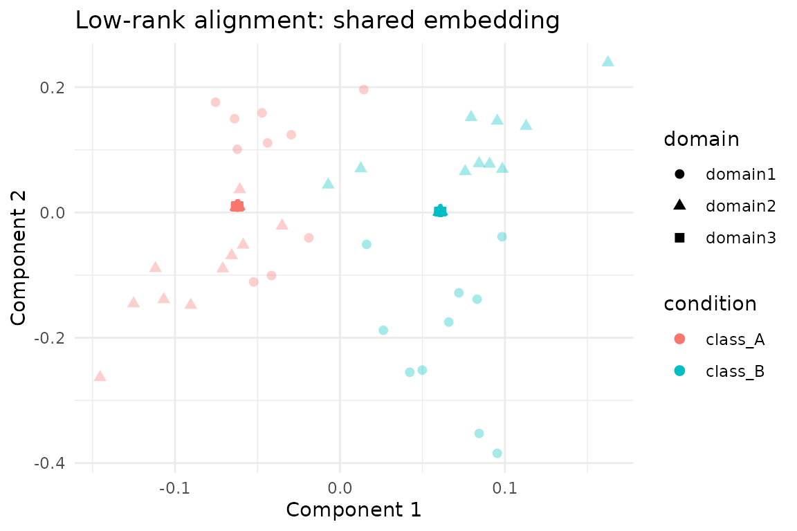

# Low-Rank Alignment with lowrank_align

## Overview

[`lowrank_align()`](https://bbuchsbaum.github.io/manifoldalign/reference/lowrank_align.md)
balances low-rank reconstruction with similarity-derived Laplacian
structure. The method was designed for partially observed labels:
unlabeled samples contribute to the low-rank term while labeled samples
supply supervision through a similarity kernel. This vignette walks
through a semi-supervised alignment workflow:

1.  Build a three-domain `hyperdesign` with missing labels in two
    domains.
2.  Construct a label-aware similarity function for the Laplacian term.
3.  Fit
    [`lowrank_align()`](https://bbuchsbaum.github.io/manifoldalign/reference/lowrank_align.md)
    and inspect the shared embedding.
4.  Summarise alignment quality with RMS discrepancies between domains.

All code uses public APIs so you can transplant the pattern to your own
data.

## Setup

``` r
library(manifoldalign)
library(multidesign)
library(multivarious)
library(tibble)
library(dplyr)
library(ggplot2)
library(purrr)
```

## Building a Partially-Labeled Hyperdesign

We start from the packaged `alignment_benchmark` dataset, convert each
domain to `multidesign` objects, and deliberately mask a subset of
labels to illustrate the semi-supervised behaviour.

``` r
alignment_benchmark <- manifoldalign::alignment_benchmark

# Convert each domain to a multidesign object
domain_list <- lapply(alignment_benchmark$domains, function(dom) {
  multidesign(dom$x, dom$design)
})

domain_names <- names(domain_list)
domain_sizes <- vapply(domain_list, function(dom) nrow(dom$x), integer(1))

# Hide labels in alternating batches for the first two domains
semi_domain_list <- domain_list
semi_domain_list[[1]]$design$condition[seq(1, domain_sizes[1], by = 4)] <- NA
semi_domain_list[[2]]$design$condition[seq(2, domain_sizes[2], by = 4)] <- NA

semi_hd <- hyperdesign(semi_domain_list)
observed_labels <- purrr::map(semi_domain_list, ~ .x$design$condition) %>% unlist()

label_status <- tibble(
  domain = rep(domain_names, times = domain_sizes),
  status = if_else(is.na(observed_labels), "unlabeled", "labeled")
) %>%
  count(domain, status)

label_status
#> # A tibble: 5 × 3
#>   domain  status        n
#>   <chr>   <chr>     <int>
#> 1 domain1 labeled      60
#> 2 domain1 unlabeled    20
#> 3 domain2 labeled      60
#> 4 domain2 unlabeled    20
#> 5 domain3 labeled      80
```

## Similarity Function for the Laplacian Term

`lowrank_align` expects a `simfun` that turns the (possibly NA) label
vector into an affinity matrix. The helper below links samples that
share the same observed label and leaves unlabeled rows/columns at zero,
which dovetails with the Laplacian masking performed inside
[`lowrank_align()`](https://bbuchsbaum.github.io/manifoldalign/reference/lowrank_align.md).

``` r
label_similarity <- function(labels) {
  labs <- as.character(labels)
  valid_levels <- unique(labs[!is.na(labs)])
  n <- length(labs)
  sim <- matrix(0, nrow = n, ncol = n)

  for (lvl in valid_levels) {
    idx <- which(labs == lvl)
    if (length(idx) > 1) {
      sim[idx, idx] <- 1
    }
  }

  diag(sim) <- 0
  sim
}

# Quick sanity check on a small slice
label_similarity(observed_labels[1:6])
#>      [,1] [,2] [,3] [,4] [,5] [,6]
#> [1,]    0    0    0    0    0    0
#> [2,]    0    0    1    1    0    1
#> [3,]    0    1    0    1    0    1
#> [4,]    0    1    1    0    0    1
#> [5,]    0    0    0    0    0    0
#> [6,]    0    1    1    1    0    0
```

## Fitting `lowrank_align`

We request three components with a moderate balance (`mu = 0.35`)
between the low-rank term `M` and the Laplacian term `L`. The
operator-based solver keeps the computation sparse without forming dense
matrices.

``` r
lowrank_fit <- lowrank_align(
  semi_hd,
  y = condition,
  simfun = label_similarity,
  mu = 0.35,
  ncomp = 3,
  sv_thresh = 0.5,
  solver = "operator"
)

str(lowrank_fit, max.level = 1)
#> List of 7
#>  $ v            : num [1:12, 1:3] -0.01432 -0.0177 -0.00885 -0.0121 -0.01832 ...
#>   ..- attr(*, "dimnames")=List of 2
#>  $ preproc      :List of 2
#>   ..- attr(*, "class")= chr [1:2] "concat_pre_processor" "pre_processor"
#>  $ s            : num [1:240, 1:3] -0.0296 -0.0622 -0.0624 -0.0626 -0.0623 ...
#>  $ sdev         : num [1:3] 0.0647 0.0647 0.0647
#>  $ block_indices:List of 3
#>  $ labels       : Factor w/ 2 levels "class_A","class_B": NA 1 1 1 NA 1 1 1 NA 1 ...
#>   ..- attr(*, "names")= chr [1:240] "domain11" "domain12" "domain13" "domain14" ...
#>  $ mu           : num 0.35
#>  - attr(*, "class")= chr [1:5] "lowrank_align" "multiblock_biprojector" "multiblock_projector" "bi_projector" ...
#>  - attr(*, ".cache")=<environment: 0x561db2a2f938>
lowrank_fit$sdev
#> [1] 0.06468462 0.06468462 0.06468462
```

## Inspecting the Shared Embedding

The returned object is a `multiblock_biprojector`, so we can extract
aligned scores and SQL-like metadata just like other `multivarious`
models.

``` r
scores_tbl <- as_tibble(as.matrix(lowrank_fit$s), .name_repair = "minimal")
colnames(scores_tbl) <- paste0("comp", seq_len(ncol(scores_tbl)))

true_labels <- rep(alignment_benchmark$labels, times = length(domain_names))

scores <- scores_tbl %>%
  mutate(
    sample = row_number(),
    domain = rep(domain_names, times = domain_sizes),
    observed_condition = observed_labels,
    condition = as.character(true_labels),
    label_status = if_else(is.na(observed_condition), "unlabeled", "labeled"),
    alpha = if_else(label_status == "labeled", 0.95, 0.35)
  )

head(scores)
#> # A tibble: 6 × 9
#>     comp1   comp2   comp3 sample domain  observed_condition condition
#>     <dbl>   <dbl>   <dbl>  <int> <chr>   <fct>              <chr>    
#> 1 -0.0296 0.124    0.0334      1 domain1 NA                 class_A  
#> 2 -0.0622 0.0108  -0.0134      2 domain1 class_A            class_A  
#> 3 -0.0624 0.00978 -0.0142      3 domain1 class_A            class_A  
#> 4 -0.0626 0.00881 -0.0153      4 domain1 class_A            class_A  
#> 5 -0.0623 0.101   -0.0213      5 domain1 NA                 class_A  
#> 6 -0.0623 0.0109  -0.0131      6 domain1 class_A            class_A  
#> # ℹ 2 more variables: label_status <chr>, alpha <dbl>
```

``` r
 ggplot(scores, aes(x = comp1, y = comp2, colour = condition, shape = domain)) +
  geom_point(aes(alpha = alpha), size = 2.1) +
  scale_alpha_identity() +
  labs(
    title = "Low-rank alignment: shared embedding",
    x = "Component 1",
    y = "Component 2"
  ) +
  theme_minimal()
```



## Domain Agreement Diagnostics

Following the other alignment vignettes, RMS discrepancies quantify how
tightly the domains co-register in the shared space. Values near zero
indicate strong agreement between domain pairs.

``` r
rms_alignment(as.matrix(lowrank_fit$s), domain_sizes, domain_names)
#> # A tibble: 3 × 3
#>   domain_i domain_j   rms
#>   <chr>    <chr>    <dbl>
#> 1 domain1  domain2  0.163
#> 2 domain1  domain3  0.120
#> 3 domain2  domain3  0.110
```

## Summary

- [`lowrank_align()`](https://bbuchsbaum.github.io/manifoldalign/reference/lowrank_align.md)
  naturally accommodates missing labels: unlabeled nodes stay in the
  low-rank term while the Laplacian only couples labeled pairs.
- The label-aware similarity function above produces a sparse Laplacian
  without touching unobserved samples, matching the algorithm’s
  expectations.
- On the benchmark data the first three components cleanly separate the
  two latent classes and keep per-domain RMS discrepancies low despite
  masked supervision.
- Switch to the explicit solver or adjust `sv_thresh` when working with
  smaller problems where dense matrices are affordable.
